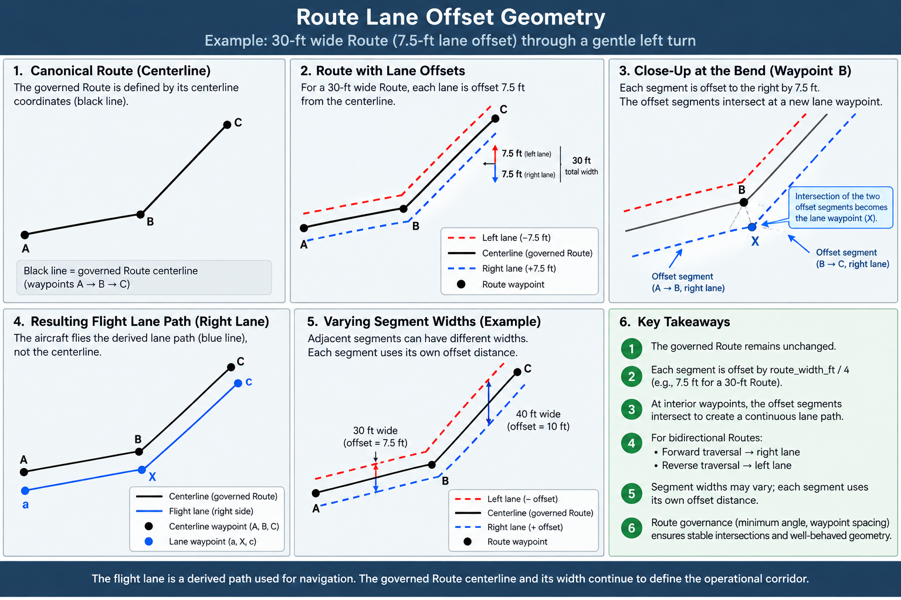

# DroneNav Horizontal Conformance Rules and Route Lane Assignment

**Status:** Phase 2 design baseline\
**Scope:** Horizontal Route lane assignment, operational lane geometry,
segment tracking, and conformance\
**Date:** September 5, 2026

## 1. Purpose

DroneNav Routes define governed horizontal flight corridors. For traffic
management, NAVProxy derives operational lanes within those governed
corridors while preserving the canonical Route geometry as the
authoritative governance geometry.

This document defines the current rules for:

-   canonical Route direction;
-   lane assignment and lane-center placement;
-   construction of operational lane geometry;
-   Route-segment tracking;
-   governed Route conformance;
-   the planned lane-specific conformance requirement; and
-   the separate aircraft lateral-clearance requirement.

The rules distinguish **governed Route geometry** from **derived
operational mission geometry**. The governed Route is never modified
merely to create a traffic lane.

## 2. Canonical Route Geometry

A Route is represented by an ordered polyline.

The stored coordinate order defines the Route's **canonical forward
direction**. Canonical forward direction is permanent for the Route and
is not reinterpreted according to the direction of an individual flight.

Route direction semantics are:

  Value   Meaning
  ------- ---------------
  `0`     Forward-only
  `1`     Reverse-only
  `2`     Bidirectional

Flight Plan creation is responsible for ensuring that an ordered Route
path is directionally valid. NAVProxy does not duplicate that governance
validation during mission execution.

The canonical Route geometry remains authoritative for:

-   the governed Route corridor;
-   Route width;
-   outer Route conformance;
-   Route timing and distance calculations;
-   energy calculations;
-   governance and survey interpretation; and
-   other functions that require the actual governed Route.

Operational lane derivation does not mutate the canonical Route.

## 3. Route Width

Route width is the **full governed corridor width**, not the distance
from the centerline to an edge.

The operational source of Route width is the `route_width_ft` value
associated with each Route segment in `segment_attributes`.

A Route may therefore have different widths on different segments.

For a segment:

``` text
half_route_width_ft = route_width_ft / 2
```

The current DroneNav default Route width is 30 ft, but NAVProxy must use
the actual governed segment width rather than assuming the default.

## 4. Lane Assignment Rule

For bidirectional traffic, DroneNav derives two operational lane
centerlines from the canonical Route.

The lateral offset from the canonical centerline is:

``` text
lane_offset_ft = route_width_ft / 4
```

Therefore, for a 30-ft Route segment:

``` text
route_width_ft          = 30 ft
half_route_width_ft     = 15 ft
lane_offset_ft          = 7.5 ft
lane_center_separation  = 15 ft
```

The quarter-width rule places each lane center halfway between the
canonical Route centerline and its corresponding Route edge.



*Figure 1 --- Route lane offset geometry. The governed Route centerline
remains unchanged while operational lane centerlines are derived from
per-segment Route width. At bends, adjacent offset segments intersect to
form the operational lane waypoint.*

### 4.1 Lane-side convention

Viewed in the Route's **canonical forward direction**:

-   **Forward traffic uses the RIGHT lane.**
-   **Reverse traffic uses the LEFT lane relative to canonical forward
    direction.**

This produces a consistent "keep right" operating convention for traffic
traveling in either direction.

The convention is fixed. It must not be dynamically reinterpreted from
an aircraft's instantaneous heading.

## 5. Operational Lane Geometry

Operational lane geometry is derived from the governed Route geometry.
It is temporary mission geometry and does not become new governed Route
geometry.

Each canonical Route segment is laterally offset by:

``` text
route_width_ft / 4
```

using the appropriate sign for the assigned lane.

A positive offset represents the right side of canonical forward travel;
a negative offset represents the left side.

### 5.1 Interior bends

DroneNav must not independently offset each canonical waypoint.

Instead:

1.  Offset each Route segment as a line.
2.  At an interior Route bend, calculate the intersection of the two
    adjacent offset lines.
3.  Use that intersection as the derived operational lane waypoint.

This produces a continuous lane polyline through gradual Route bends.

Conceptually:

``` text
canonical segment A  ────────┐
                             │ gradual bend
canonical segment B          └────────

        ↓ offset each segment
        ↓ intersect adjacent offset lines

operational lane A   ────────┐
                             │
operational lane B            └────────
```

This rule also allows adjacent Route segments to derive their offsets
from their own `route_width_ft` values.

A policy for collinear adjacent segments whose widths change is not yet
defined and must not be invented implicitly by NAVProxy.

## 6. Route Geometry Constraints

The lane-offset model assumes that a Route consists of straight or
gradual segments.

Sharp turns and junction behavior are separate traffic-management
concerns.

Current design direction:

-   a sharp turn, such as approximately 90 degrees, should normally be
    represented as a junction between Routes rather than as a severe
    bend inside one Route;
-   Route geometry should use reasonable waypoint spacing; and
-   an initial governance rule under consideration is a minimum interior
    angle of 120 degrees.

These geometry rules remain subject to formalization in the Route
survey/governance tooling.

Aircraft-specific turn-radius validation is a separate future
requirement associated with the Aircraft Profile.

## 7. Route-to-Route Transitions

Route junctions, merges, splits, and crossings are distinct from lane
construction within a Route.

NAVProxy must not silently alter governed Route endpoints to make
adjacent Routes connect.

If two Routes are intended to meet but their surveyed endpoints differ
slightly, the preferred correction is upstream governance:

-   snap intended junction endpoints when they are within an approved
    survey tolerance; or
-   flag larger discrepancies for surveyor review.

NAVProxy may execute a legitimate short transition between successive
Route mission geometries, but it must not rewrite the governed geometry.

Detailed junction traffic-management rules are deferred.

## 8. Operational Segment Tracking

Once an aircraft is assigned an offset operational lane, NAVProxy must
track Route-segment progression using the **operational lane segment
geometry**, not the canonical centerline segment geometry.

Each conformance segment therefore needs both coordinate pairs:

``` text
canonical:
    start_coordinate
    end_coordinate

operational:
    operational_start_coordinate
    operational_end_coordinate
```

The canonical coordinates remain authoritative for governed Route
functions.

The operational coordinates are used for determining when the aircraft
has crossed the forward boundary of its current operational segment and
should advance to the next Route segment.

### 8.1 Reason for the separation

When mission waypoints were located on the canonical Route centerline,
canonical and operational segment boundaries coincided.

After lane offsets were introduced, those boundaries no longer
necessarily coincide at bends.

Using the canonical segment endpoint to advance an aircraft flying an
offset lane can cause NAVProxy to retain the previous segment after the
aircraft has already begun flying the next operational lane segment.
Conformance would then be evaluated against the wrong canonical segment.

The correct separation is:

``` text
Canonical Route geometry
        |
        +-- governed Route conformance
        +-- governance
        +-- timing / energy

Operational lane geometry
        |
        +-- mission waypoints
        +-- active Route-segment advancement
```

This architecture was SITL-validated on September 5, 2026. After
operational lane endpoints were used for segment advancement, the test
mission completed with no Route conformance violations.

## 9. Governed Route Conformance

The current horizontal conformance rule answers:

> Is the aircraft still inside the governed Route corridor?

For the active Route segment, NAVProxy evaluates the aircraft position
against the canonical segment centerline and the segment's governed
`route_width_ft`.

The nominal allowable centerline distance is:

``` text
allowed_offset_ft = route_width_ft / 2
```

For a 30-ft Route:

``` text
allowed_offset_ft = 15 ft
```

This check must continue to use:

``` text
start_coordinate
end_coordinate
route_width_ft
```

from the canonical Route segment.

It must **not** be changed to use the operational lane centerline,
because doing so would change the meaning of the existing governed Route
conformance assertion.

## 10. Lane-Specific Conformance --- Required Follow-on

Governed Route conformance and lane conformance answer different
questions.

**Governed Route conformance:**

> Is the aircraft still inside the authorized Route corridor?

**Lane conformance:**

> Is the aircraft remaining within its assigned traffic lane?

Both are required for the complete horizontal traffic-management model.

An aircraft could remain inside the governed Route while drifting far
enough from its assigned lane to interfere with opposing traffic.
Therefore, outer Route conformance alone is not sufficient for
bidirectional traffic management.

Lane-specific conformance remains a follow-on requirement.

No arbitrary fixed lane-conformance tolerance should be introduced until
the aircraft lateral-clearance model is defined.

## 11. Aircraft Lateral-Clearance Assertion --- Separate Requirement

Aircraft physical dimensions must **not** move the operational lane
center.

The lane center remains determined solely by Route geometry:

``` text
lane_offset_ft = route_width_ft / 4
```

Aircraft characteristics instead determine whether an aircraft can
safely use that lane and how much deviation from the lane center can be
permitted.

The planned clearance model must account for at least:

``` text
aircraft half-width
+ navigation/control uncertainty
+ required safety clearance
```

For the quarter-width lane rule, the geometric lateral budget from a
lane center to the nearest Route edge is:

``` text
route_width_ft / 4
```

The same quarter-width geometry also determines half of the nominal
separation between opposing lane centers.

A prospective allowable lane deviation can therefore be expressed
conceptually as:

``` text
allowable_lane_deviation_ft =
    route_width_ft / 4
    - aircraft_half_width_ft
    - navigation_control_margin_ft
    - required_safety_clearance_ft
```

The exact fields, terminology, and policy values are not yet finalized.

If the resulting available clearance is zero or negative, the
aircraft/Route combination should fail a preflight clearance assertion
rather than moving the lane center.

This requirement depends on the future DroneNav Aircraft Profile.

## 12. Aircraft Profile Dependency

The Aircraft Profile is expected to reside in Drupal as governed
configuration and be exposed through the DroneNav API for operational
consumers such as NAVProxy.

NAVProxy should not read Drupal directly.

Conceptually:

``` text
Drupal Aircraft Profile
        |
        v
DroneNav API representation
        |
        v
NAVProxy preflight assertions
        |
        v
runtime enforcement
```

Physical aircraft width is one required input to the future
lateral-clearance assertion.

Other likely operational characteristics, such as positioning accuracy,
control/tracking accuracy, and turn radius, require separate Aircraft
Profile design before they become part of the conformance model.

## 13. Current Implementation Baseline

As of September 5, 2026, the validated horizontal architecture is:

``` text
Governed Route
    |
    +-- canonical centerline
    |       |
    |       +-- Route corridor conformance
    |       +-- governance
    |       +-- timing / energy
    |
    +-- segment route_width_ft
            |
            v
       width / 4 offset
            |
            v
    Operational lane centerline
            |
            +-- mission waypoints
            +-- Route-segment boundary advancement
```

The right-hand operational lane has been validated through the full
NAVProxy/SITL execution path.

The remaining horizontal-conformance work is intentionally separated
into:

1.  **Lane-specific runtime conformance**
2.  **Aircraft lateral-clearance preflight assertion**
3.  **Aircraft Profile design and API representation**
4.  **Formal Route geometry/survey constraints**
5.  **Route junction, merge, split, and crossing traffic rules**

## 14. Governing Principles

The horizontal traffic implementation should continue to follow these
principles:

-   Preserve governed Route geometry.
-   Derive operational geometry rather than mutating governance data.
-   Use actual per-segment Route width.
-   Keep lane centers deterministic and independent of individual
    aircraft dimensions.
-   Use operational geometry for operational segment progression.
-   Use canonical geometry for governed Route conformance.
-   Treat lane conformance as distinct from outer Route conformance.
-   Derive aircraft-specific clearance from explicit aircraft and safety
    characteristics rather than arbitrary fixed tolerances.
-   Reject unsafe aircraft/Route combinations during preflight rather
    than silently changing lane geometry.
-   Keep Route junction traffic management separate from within-Route
    lane geometry.

